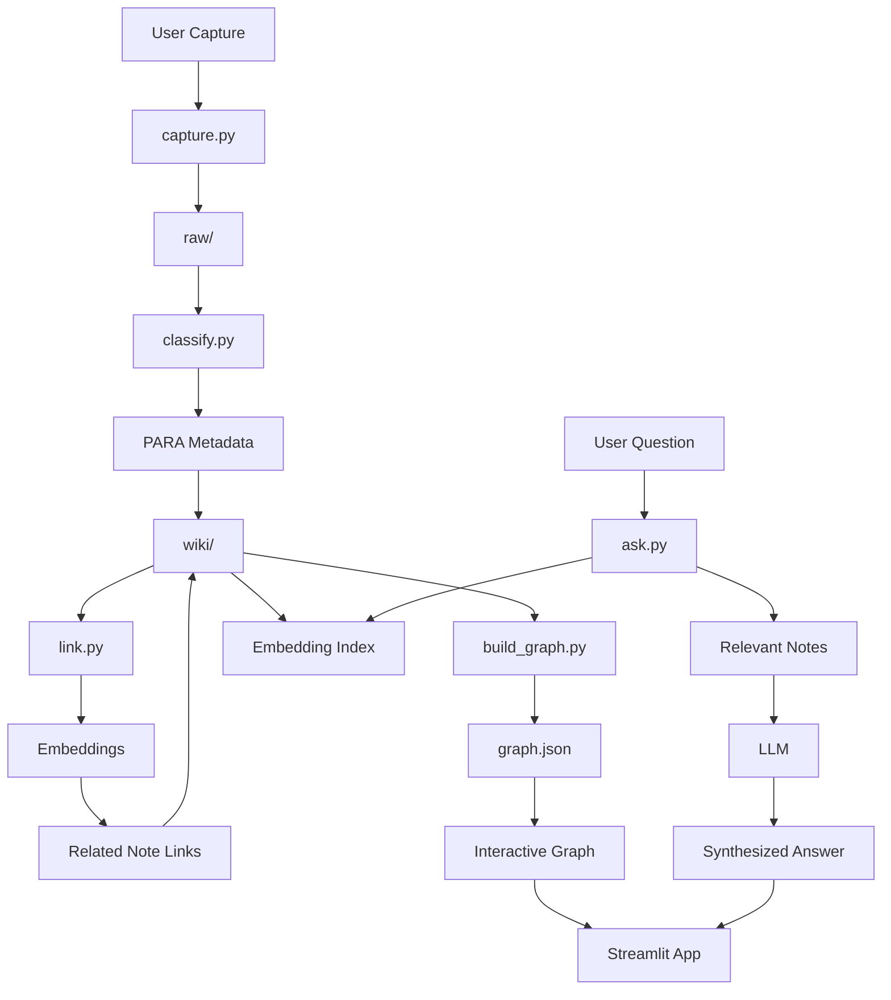

# SecondSelf Architecture

## 1. System Overview

SecondSelf is a local-first knowledge pipeline with five layers:

1. **Capture layer**: accepts notes, links, and files.
2. **Organization layer**: classifies captures using PARA, tags, and summaries.
3. **Knowledge layer**: generates embeddings and discovers related notes.
4. **Graph layer**: converts notes and relationships into graph JSON.
5. **Query layer**: retrieves relevant notes and synthesizes answers with an LLM.



---

## 2. Recommended Repository Structure

```text
secondself/
├── raw/
│   ├── captures/
│   └── attachments/
├── wiki/
│   ├── Projects/
│   ├── Areas/
│   ├── Resources/
│   └── Archives/
├── data/
│   ├── embeddings/
│   ├── metadata.json
│   └── graph.json
├── scripts/
│   ├── capture.py
│   ├── classify.py
│   ├── link.py
│   └── build_graph.py
├── secondself/
│   ├── config.py
│   ├── models.py
│   ├── storage.py
│   ├── llm.py
│   ├── embeddings.py
│   ├── retrieval.py
│   ├── ask.py
│   └── pipeline.py
├── app.py
├── requirements.txt
├── .env.example
├── .gitignore
└── README.md
```

The `scripts/` directory contains command-line entry points. The `secondself/` package contains reusable application logic so the Streamlit app and CLI use the same code.

---

## 3. Core Data Model

### Raw Capture

Each input becomes one immutable raw capture.

```json
{
  "id": "cap_20260918_7f3a2c",
  "captured_at": "2026-09-18T14:32:10Z",
  "type": "note",
  "source": "cli",
  "title": "Learning about vector search",
  "content": "Vector search finds semantically similar content...",
  "url": null,
  "file_path": null,
  "status": "unprocessed"
}
```

Supported capture types:

- `note`
- `link`
- `file`

Raw captures should never be overwritten. Processing metadata belongs in the wiki or a separate index.

### Wiki Note

Each processed note is Markdown with YAML front matter.

```markdown
---
id: cap_20260918_7f3a2c
title: Learning about vector search
category: Resources
tags:
  - embeddings
  - retrieval
summary: Vector search retrieves semantically related knowledge.
created_at: 2026-09-18T14:32:10Z
processed_at: 2026-09-18T14:40:00Z
embedding_model: all-MiniLM-L6-v2
related_notes:
  - cap_20260917_a81d22
---

Vector search finds semantically similar content...

## Related Notes

- [[cap_20260917_a81d22]]
```

### Graph Format

```json
{
  "nodes": [
    {
      "id": "cap_20260918_7f3a2c",
      "label": "Learning about vector search",
      "category": "Resources",
      "summary": "Vector search retrieves semantically related knowledge.",
      "content": "Vector search finds semantically similar content..."
    }
  ],
  "edges": [
    {
      "source": "cap_20260918_7f3a2c",
      "target": "cap_20260917_a81d22",
      "weight": 0.82,
      "type": "semantic"
    }
  ]
}
```

---

## 4. Capture Architecture

### Command Interface

Use one command with subcommands:

```bash
python capture.py note "An idea about building a personal knowledge graph"
python capture.py link "https://example.com/article" --title "Useful article"
python capture.py file "C:\Users\Name\Documents\paper.pdf"
```

Optional input modes:

```bash
python capture.py note --stdin
python capture.py note --file note.txt
```

### Capture Responsibilities

`capture.py` should:

1. Validate the input.
2. Generate a unique ID using a timestamp plus a UUID fragment.
3. Record the UTC capture time.
4. Detect the capture type.
5. Copy files into `raw/attachments/`.
6. Write structured metadata.
7. Preserve the original content exactly.
8. Return the generated ID.

Recommended implementation details:

- Use `uuid.uuid4()` for uniqueness.
- Store timestamps in UTC using timezone-aware datetimes.
- Use JSON for machine-readable metadata.
- Use Markdown or plain text for human-readable content.

---

## 5. Classification Architecture

The classifier receives a raw capture and returns strict structured JSON.

### Classification Contract

```json
{
  "category": "Projects",
  "tags": ["secondself", "architecture", "ai"],
  "summary": "Architecture notes for building the SecondSelf knowledge system.",
  "title": "SecondSelf Architecture"
}
```

### PARA Classification Rules

- **Projects**: Has a defined outcome or deadline.
- **Areas**: Ongoing responsibilities or domains.
- **Resources**: Useful reference material.
- **Archives**: Inactive or completed material.

### LLM Design

Create an LLM adapter instead of calling a provider directly from `classify.py`.

```python
class LLMProvider:
    def classify(self, content: str) -> dict:
        ...

    def answer(self, question: str, context: str) -> str:
        ...
```

The first implementation can use Groq and Llama 3. The provider should be configurable through environment variables:

```env
LLM_PROVIDER=groq
GROQ_API_KEY=
LLM_MODEL=llama-3.1-8b-instant
```

The prompt should require:

- Valid JSON only.
- Exactly one PARA category.
- A bounded number of tags.
- A short summary.
- No invented facts.

If parsing fails, retry once with a JSON-correction prompt. If it still fails, mark the item as `classification_failed` instead of losing it.

---

## 6. Wiki Storage

The wiki should remain readable without the application.

```text
wiki/
├── Projects/
│   └── cap_20260918_7f3a2c-secondself-architecture.md
├── Areas/
├── Resources/
└── Archives/
```

Each note should contain:

- Original capture ID.
- Original content.
- Classification metadata.
- Summary.
- Tags.
- Embedding model and version.
- Related note links.
- Processing timestamps.

Use stable capture IDs in links rather than filenames. This prevents links from breaking if a title changes.

---

## 7. Embedding and Auto-Linking

### Embedding Model

Use a local sentence-transformer:

```text
sentence-transformers/all-MiniLM-L6-v2
```

Advantages:

- Free.
- Runs locally.
- Requires no API key.
- Suitable for the initial project scale.

Store embeddings in:

```text
data/embeddings/
├── embeddings.npy
└── index.json
```

For a larger dataset, use FAISS or Chroma. For the first version, NumPy cosine similarity is sufficient.

### Similarity

For vectors $a$ and $b$, cosine similarity is:

$$
\operatorname{similarity}(a,b)
=
\frac{a \cdot b}{\|a\|\|b\|}
$$

Suggested thresholds:

```text
similarity >= 0.78       strong relationship
0.68 <= similarity < 0.78 possible relationship
similarity < 0.68        no automatic link
```

The threshold should be configurable because the ideal value depends on the embedding model and the real notes.

### Linking Process

For every new note:

1. Generate its embedding.
2. Compare it with existing wiki embeddings.
3. Ignore the note itself.
4. Select the top five matches.
5. Keep matches above the threshold.
6. Add bidirectional wiki links.
7. Add graph edges with similarity weights.
8. Rebuild the embedding index.

Avoid duplicate links by checking whether the target ID already appears in `related_notes`.

---

## 8. Pipeline Orchestration

Create a single pipeline entry point:

```bash
python pipeline.py process-all
```

Processing stages:

```text
raw capture
  -> classify
  -> write wiki note
  -> embed
  -> find related notes
  -> update links
  -> rebuild graph
```

Useful commands:

```bash
python pipeline.py process cap_20260918_7f3a2c
python pipeline.py process-all
python pipeline.py rebuild-index
python pipeline.py rebuild-graph
```

Each stage should be idempotent. Running the same command twice should not create duplicate notes, links, or graph nodes.

Recommended processing statuses:

```text
unprocessed
classifying
classified
embedding
linked
complete
failed
```

Errors should be recorded per capture so one malformed file does not stop a complete batch.

---

## 9. Graph Generation

`build_graph.py` should parse all Markdown notes and produce `data/graph.json`.

### Nodes

Each note becomes a node containing:

- ID
- Title
- PARA category
- Tags
- Summary
- Content preview

### Edges

Edges come from:

1. Explicit `[[note-id]]` links.
2. Semantic similarity links.
3. Optional future link types such as shared tags.

Example edge types:

```text
semantic
manual
shared-tag
```

The graph builder should not call the LLM. It should derive graph data deterministically from wiki files.

---

## 10. Streamlit Application

The Streamlit app should contain three primary views.

### Ask

- Question input.
- Submit button.
- Synthesized answer.
- Source notes.
- Similarity scores.
- Links to source note content.

### Brain Graph

- Interactive force-directed graph.
- Pan, zoom, and drag.
- Node color by PARA category.
- Hover tooltip with title and summary.
- Click interaction showing full note content.

`streamlit-agraph`, PyVis, or a custom HTML component can render the graph. PyVis is a practical first choice because it supports force-directed layouts and HTML tooltips.

### Capture

- Text input.
- URL input.
- File uploader.
- Capture button.
- Processing status.
- Generated capture ID.

Suggested layout:

```text
Sidebar:
  Ask
  Brain Graph
  Capture
  Settings

Main panel:
  Active view
```

---

## 11. Retrieval-Augmented Q&A

The `ask()` function follows this sequence:

```text
question
  -> question embedding
  -> nearest wiki notes
  -> optional graph-neighbor expansion
  -> context assembly
  -> LLM answer
  -> cited response
```

### Retrieval

1. Embed the question.
2. Search the embedding index.
3. Select the top five notes.
4. Optionally include directly linked neighbors.
5. Remove duplicate content.
6. Limit the context size.

Suggested defaults:

```text
top_k = 5
similarity_threshold = 0.60
neighbor_expansion = 1 graph hop
```

### Prompt Contract

The answer model should be instructed to:

- Use only the supplied context.
- State when the notes do not contain enough information.
- Avoid inventing facts.
- Cite source note titles or IDs.
- Separate direct evidence from inference.

Example output:

```text
Based on your notes, the main recommendation is ...

Sources:
- Learning about vector search
- SecondSelf Architecture
```

Source display is important because it makes answers inspectable and trustworthy.

---

## 12. Deployment Architecture

### Recommended Deployment

Use Streamlit Community Cloud for the first public deployment.

```text
GitHub repository
  -> Streamlit Cloud
  -> app.py
  -> wiki/ and data/
  -> configured secrets
```

Required deployment files:

```text
requirements.txt
.streamlit/
└── config.toml
```

Secrets should be configured in the deployment platform and never committed:

```toml
GROQ_API_KEY = "..."
```

### Deployment Persistence Constraint

A deployed Streamlit app should not be treated as permanent writable storage. Local filesystem changes may be lost when the app restarts.

Use one of these strategies:

1. **Read-only public demo**: deploy the curated wiki and graph with capture disabled.
2. **Git-backed persistence**: capture creates changes and commits them through a controlled GitHub integration.
3. **External database/storage**: use Supabase, SQLite on a persistent volume, S3, or another hosted store.

For the first milestone, the simplest reliable architecture is:

- Build and process notes locally.
- Commit `wiki/`, `data/`, and `graph.json`.
- Deploy the app as a read-heavy public knowledge brain.
- Add persistent online capture later.

---

## 13. Configuration

Centralize settings in `config.py`:

```python
RAW_DIR = "raw"
WIKI_DIR = "wiki"
DATA_DIR = "data"

EMBEDDING_MODEL = "sentence-transformers/all-MiniLM-L6-v2"
SIMILARITY_THRESHOLD = 0.68
TOP_K = 5
```

Allow environment variables to override defaults:

```env
WIKI_DIR=wiki
TOP_K=5
SIMILARITY_THRESHOLD=0.68
```

---

## 14. Testing Strategy

### Unit Tests

Test:

- ID generation.
- Timestamp formatting.
- Note capture.
- Link capture.
- File capture.
- YAML parsing.
- PARA validation.
- Embedding dimensions.
- Cosine similarity.
- Duplicate link prevention.
- Graph node and edge generation.
- Retrieval ranking.

### Integration Tests

Run the complete local flow:

```text
capture note
  -> classify
  -> write wiki note
  -> generate embedding
  -> create related link
  -> generate graph
  -> retrieve note for question
```

### Acceptance Dataset

Use at least:

- 5 notes.
- 5 links.
- 5 files or document captures.
- At least 15 total real items.
- Several intentionally related items.
- Several unrelated items.
- At least 5 real questions whose answers exist in the notes.

Avoid testing only with synthetic examples. The project goal depends on observing behavior over personal information.

---

## 15. Four-Week Implementation Plan

### Week 1: Archivist

Deliver:

- Repository scaffold.
- `capture.py`.
- `raw/` and `wiki/`.
- Note, link, and file capture.
- 10 or more real captures.
- Basic README usage instructions.

### Week 2: Librarian

Deliver:

- LLM provider adapter.
- PARA classification.
- Tags and summaries.
- Wiki Markdown generation.
- Local embeddings.
- Similarity-based auto-linking.
- 15 or more processed real items.

### Week 3: Cartographer

Deliver:

- Deterministic graph builder.
- `graph.json`.
- Interactive graph view.
- Node hover details.
- Drag and zoom support.
- Category-based node styling.

### Week 4: Oracle

Deliver:

- Retrieval pipeline.
- `ask()` function.
- Source-aware LLM answers.
- Streamlit capture, graph, and ask views.
- Deployment configuration.
- Public URL.
- README with setup and architecture documentation.

---

## 16. Key Design Principles

- Preserve raw captures permanently.
- Keep the wiki human-readable.
- Make every processing stage repeatable.
- Keep LLM calls behind provider interfaces.
- Use local embeddings to control cost and privacy.
- Cite sources in every generated answer.
- Store model names and processing timestamps.
- Treat graph generation as deterministic.
- Make failed items visible and recoverable.
- Deploy curated data first, then add persistent online writes.

This architecture is sufficient for the four-week milestone while leaving a clean path toward a larger system with database storage, background jobs, authentication, richer graph queries, and multiple LLM providers.
